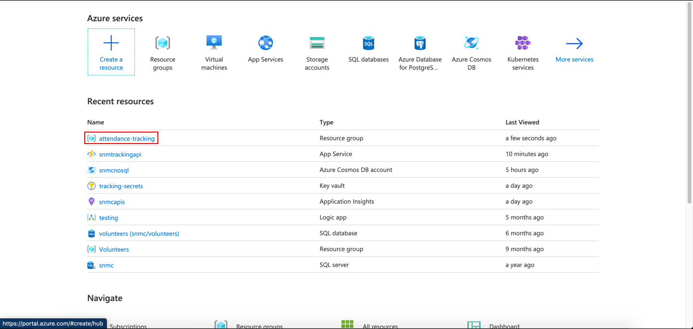
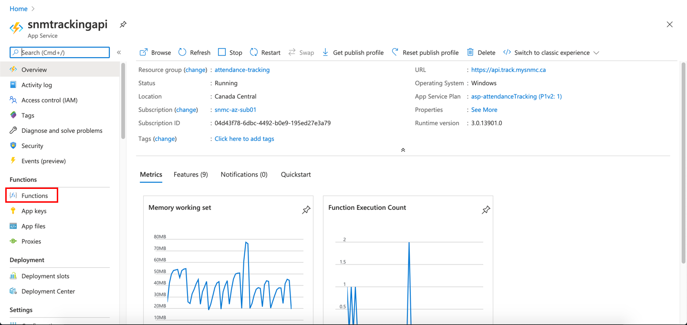
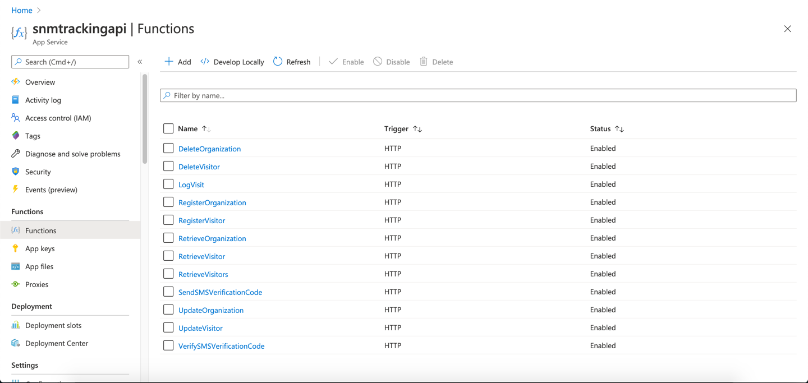
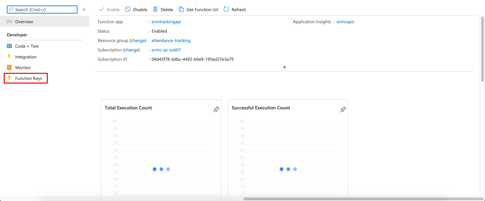
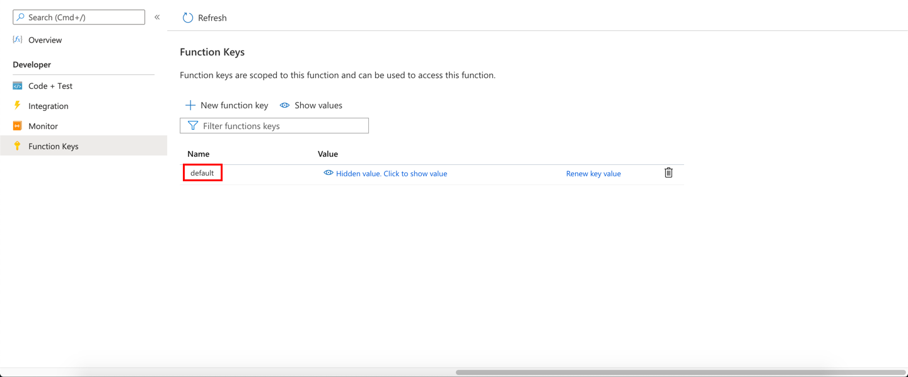
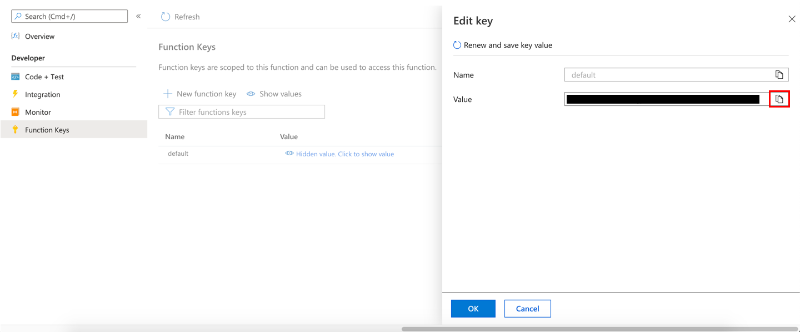

# Covid Tracking App Documentation - Register Visitor API

- [Covid Tracking App Documentation - Register Visitor API](#covid-tracking-app-documentation---register-visitor-api)
  - [Getting the ```Function Key```](#getting-the-function-key)
  - [API Info](#api-info)
    - [Request Type](#request-type)
    - [Request URL](#request-url)
    - [Custom Request Headers](#custom-request-headers)
    - [Request Body](#request-body)
      - [Mandatory Parameters](#mandatory-parameters)
      - [Optional Parameters](#optional-parameters)
    - [Response](#response)
      - [Success](#success)
        - [Status Code](#status-code)
        - [Body](#body)
      - [Failure](#failure)
        - [Status Code](#status-code-1)
        - [Body](#body-1)
  - [Notes](#notes)

## Getting the ```Function Key```

In order to get the function key, you will need to navigate to portal.azure.com and sign in with your credentials.

Once you are on the Azure Portal, click on the ```attendance-tracking``` resource group.



Next, scroll down and click on the ```snmtrackingapi``` resource.


Next, click on the ```Functions``` page in the side pane.



From here, select the API that you need the function key for, in this case, we will be getting the function key for the ```RegisterVisitor``` API



Next, click on the ```Function Keys``` page in the side pane.



Next, click on the word ```Default```.



Finally, click the ```Copy``` button next to the ```Value``` field to copy the ```Function Key```.



## API Info

### Request Type

```
POST
```

### Request URL

```
https://api.track.mysnmc.ca/api/user
```

### Custom Request Headers

```json
{
    "x-functions-key": "COPIED FROM AZURE"
}
```

### Request Body

#### Mandatory Parameters

```json
{
	"FirstName": "First Name",
	"LastName": "Last Name",
	"Email": "email@address.com",
	"PhoneNumber": "XXXXXXXXXX",
	"IsMale": 1
}
```

#### Optional Parameters

```json
{
    "Address": "1234 156 Ave"
}
```

### Response

#### Success

##### Status Code

```
200
```

##### Body

```json
{ "{{VisitorId}}" }
```

#### Failure

##### Status Code

```
400
```

##### Body

```json
{ "{{ErrorMessage}}" }
```

## Notes

