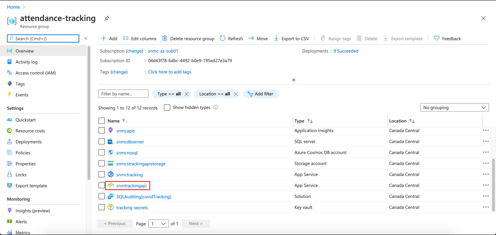
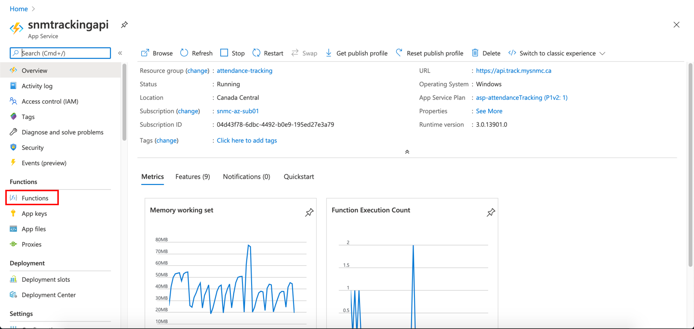
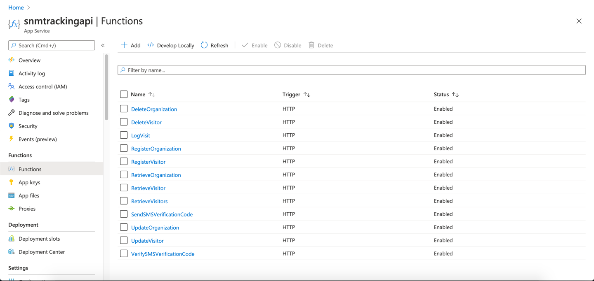
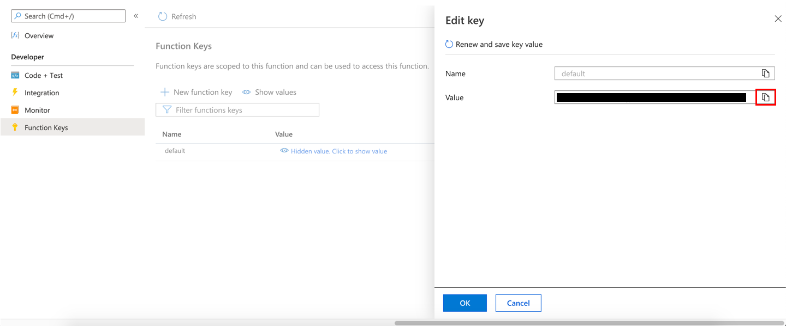

# COVID-19 TRACKING APP API DOCUMENTATION

// Generate table of contents here <br>

## Getting the ```Function Key```

In order to get the function key, you will need to navigate to portal.azure.com and sign in with your credentials.

Once you are on the Azure Portal, click on the ```attendance-tracking``` resource group.


Next, scroll down and click on the ```snmtrackingapi``` resource.



Next, click on the ```Functions``` page in the side pane.



From here, select the API that you need the function key for, in this case, we will be getting the function key for the ```RegisterVisitor``` API



Next, click on the ```Function Keys``` page in the side pane.


Next, click on the word ```Default```.


Finally, click the ```Copy``` button next to the ```Value``` field to copy the ```Function Key```.



---

## APIs 