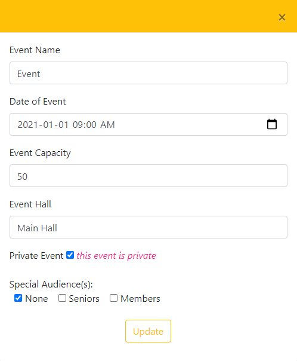

# Admin-Web-App

------

## Login

Login to your admin account with the credentials created.

------

## Visitor Registration

Admins can create visitor accounts for anyone who does not have the means to do so themselves.

Upon creating the account, you can either bypass verification or proceed to enter the verification code received by text message.

Right after, the visitor will be logged in.

------

## Visitor Login

Admins can login visitor who do not have their device with them. 

You can either enter their first name, last name, and phone number and then sign in, or enter 2 of the three fields and search.

When the visitor is logged in, there QR code will be shown and they can be scanned in. After this, you can either register another visitor or login another visitor. 

------

## Events

Admins also have the ability to create events being hosted.

When creating events, admins can choose the event name, date, capacity, and event hall. There's also options for public or events and making events only available for special audiences (i.e. seniors).

Admins can also view and edit all events taking place. 

From here, admins can group events together, get registrants for an event, update an event or delete an event. 

