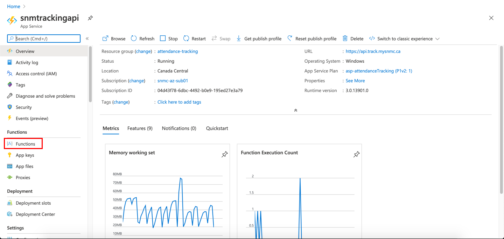
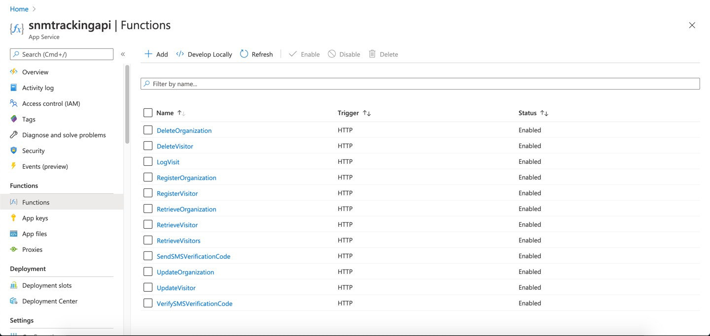
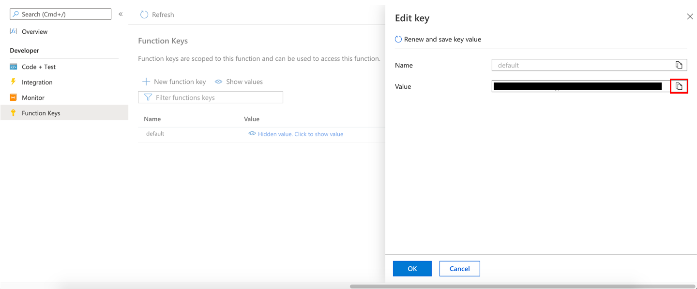

# COVID-19 TRACKING APP API DOCUMENTATION

// Generate table of contents here <br>

## Getting the ```Function Key```

In order to get the function key, you will need to navigate to portal.azure.com and sign in with your credentials.

Once you are on the Azure Portal, click on the ```attendance-tracking``` resource group.


Next, scroll down and click on the ```snmtrackingapi``` resource.


Next, click on the ```Functions``` page in the side pane.



From here, select the API that you need the function key for, in this case, we will be getting the function key for the ```RegisterVisitor``` API



Next, click on the ```Function Keys``` page in the side pane.


Next, click on the word ```Default```.


Finally, click the ```Copy``` button next to the ```Value``` field to copy the ```Function Key```.



---

## APIs <br>

## :dromedary_camel: Organization_Testing <br>

## :pineapple: Test Name: Retrieve_Organization_Test_Online

### Description

> Online test to retrieve a single organization by Id

### Request Type

> GET

### Request URL

> https://api.track.mysnmc.ca/api/organization/1


### Custom Request Headers

```json
{
  "key": "x-functions-key", 
  "type": "text", 
  "value": "value"
}
```

### Request Body

#### Mandatory Parameters

```json

None

```

#### Optional Parameters

```json

None

```
<br><br>

## :pineapple: Test Name: Register_Organization_Test_Online

### Description

> Online test for registering organization

### Request Type

> POST

### Request URL

> https://api.track.mysnmc.ca/api/organization


### Custom Request Headers

```json
{
  "key": "x-functions-key", 
  "type": "text", 
  "value": "value"
}
```

### Request Body

#### Mandatory Parameters

```json

{
  "Name": "KMA"
}

```

#### Optional Parameters

```json

{
  "language": "json"
}

```
<br><br>

## :pineapple: Test Name: Update_Organization_Test_Online

### Description

> 

### Request Type

> PUT

### Request URL

> https://api.track.mysnmc.ca/api/organization


### Custom Request Headers

```json
{
  "key": "x-functions-key", 
  "type": "text", 
  "value": "value"
}
```

### Request Body

#### Mandatory Parameters

```json

{
  "Id": "id", 
  "Name": "OMA2"
}

```

#### Optional Parameters

```json

{
  "language": "json"
}

```
<br><br>

## :pineapple: Test Name: Delete_Organization_Test_Online

### Description

> Online test to delete a single organization by Id

### Request Type

> DELETE

### Request URL

> https://api.track.mysnmc.ca/api/organization/2


### Custom Request Headers

```json
{
  "key": "x-functions-key", 
  "type": "text", 
  "value": "value"
}
```

### Request Body

#### Mandatory Parameters

```json

None

```

#### Optional Parameters

```json

None

```
<br><br>

## :dromedary_camel: Visitor_Testing <br>

## :pineapple: Test Name: Retrieve_Visitor_Test_Online

### Description

> Online test to retrieve a single visitor by Id

### Request Type

> GET

### Request URL

> https://api.track.mysnmc.ca/api/user/{{myGUID}}


### Custom Request Headers

```json
{
  "key": "x-functions-key", 
  "type": "text", 
  "value": "value"
}
```

### Request Body

#### Mandatory Parameters

```json

None

```

#### Optional Parameters

```json

None

```
<br><br>

## :pineapple: Test Name: Retrieve_Visitors_Test_Online

### Description

> Online Test for Retrieving Visitors

### Request Type

> GET

### Request URL

> https://api.track.mysnmc.ca/api/users?Email=Ali.Baba@SNMC.ca


### Custom Request Headers

```json
{
  "key": "x-functions-key", 
  "type": "text", 
  "value": "value"
}
```

### Request Body

#### Mandatory Parameters

```json

None

```

#### Optional Parameters

```json

None

```
<br><br>

## :pineapple: Test Name: Register_Visitor_Test_Online

### Description

> Online test for registering visitor

### Request Type

> POST

### Request URL

> https://api.track.mysnmc.ca/api/user


### Custom Request Headers

```json
{
  "key": "x-functions-key", 
  "type": "text", 
  "value": "value"
}
```

### Request Body

#### Mandatory Parameters

```json

{
  "Email": "Ali.Baba@SNMC.ca", 
  "FirstName": "Ali", 
  "IsMale": 1, 
  "IsVerified": 0, 
  "LastName": "Baba", 
  "PhoneNumber": "#########"
}

```

#### Optional Parameters

```json

{
  "language": "json"
}

```
<br><br>

## :pineapple: Test Name: Update_Visitor_Test_Online

### Description

> Online test for updating visitors

### Request Type

> PUT

### Request URL

> https://api.track.mysnmc.ca/api/user


### Custom Request Headers

```json
{
  "key": "x-functions-key", 
  "type": "text", 
  "value": "value"
}
```

### Request Body

#### Mandatory Parameters

```json

{
  "Email": "Ali.Baba@SNMC.ca", 
  "FirstName": "Ali", 
  "Id": "id", 
  "IsMale": 1, 
  "LastName": "Baba", 
  "PhoneNumber": "#########"
}

```

#### Optional Parameters

```json

{
  "language": "json"
}

```
<br><br>

## :pineapple: Test Name: Delete_Visitor_Test_Online

### Description

> Online test to delete a single organization by Id

### Request Type

> DELETE

### Request URL

> https://api.track.mysnmc.ca/api/user/{{myGUID}}


### Custom Request Headers

```json
{
  "key": "x-functions-key", 
  "type": "text", 
  "value": "value"
}
```

### Request Body

#### Mandatory Parameters

```json

None

```

#### Optional Parameters

```json

None

```
<br><br>

## :dromedary_camel: Visit_Logging_Testing <br>

## :pineapple: Test Name: Log_Visit_Online

### Description

> Online test for logging visit

### Request Type

> POST

### Request URL

> https://api.track.mysnmc.ca/api/visits


### Custom Request Headers

```json
{
  "key": "x-functions-key", 
  "type": "text", 
  "value": "value"
}
```

### Request Body

#### Mandatory Parameters

```json

{
  "Direction": "In", 
  "Door": "North-West", 
  "Organization": "SNMC", 
  "VisitorId": "visitor alphanumeric id"
}

```

#### Optional Parameters

```json

{
  "language": "json"
}

```
<br><br>

## :dromedary_camel: SMS_Testing <br>

## :pineapple: Test Name: Verify_SMS_Verification_Code_Test_Online

### Description

> Online test for verifying SMS Verification Code

### Request Type

> POST

### Request URL

> https://api.track.mysnmc.ca/api/user/verify


### Custom Request Headers

```json
{
  "key": "x-functions-key", 
  "type": "text", 
  "value": "value"
}
```

### Request Body

#### Mandatory Parameters

```json

{
  "Id": "id", 
  "PhoneNumber": "#########", 
  "VerificationCode": "129632"
}

```

#### Optional Parameters

```json

{
  "language": "json"
}

```
<br>